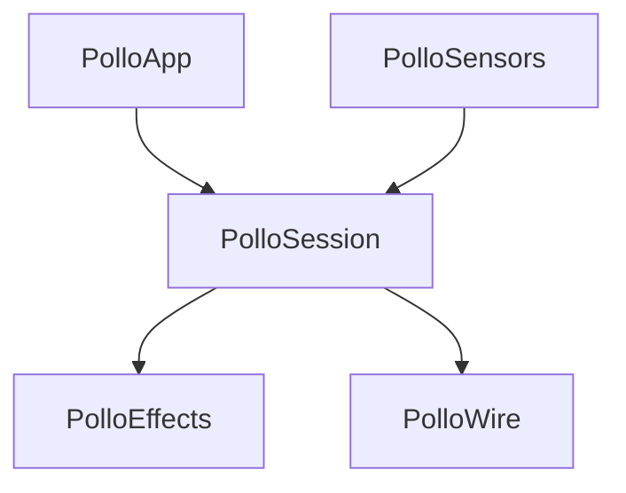
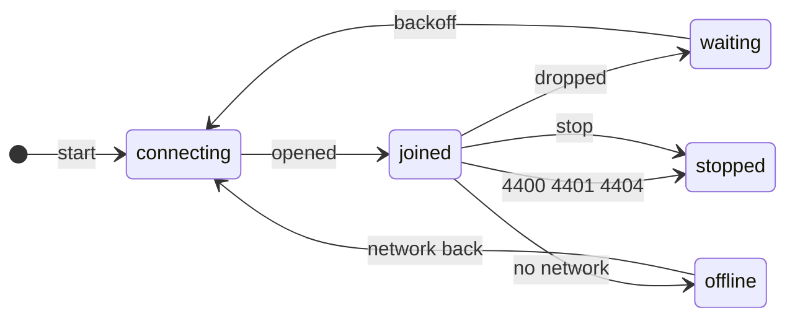
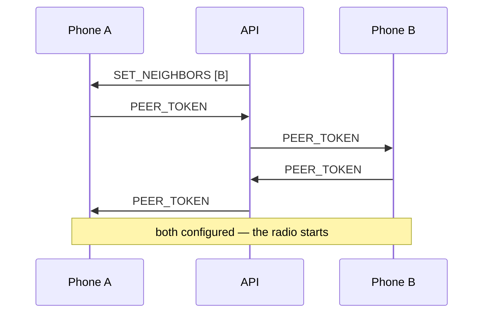

# Mobile

The sensor of the system. A phone reports its GPS reading and the ultra-wideband
distance to the peers the server names, and gets back its own position and the
cues it renders itself.

```bash
just mobile-build      # no Apple framework needed
just mobile-test       # 37 tests, no Xcode needed
just mobile-fixtures   # rewrite the Swift test fixtures from the contract
```

## iOS app

The SwiftUI app lives in `Apple/PolloApp`; `Apple/PolloSensors` contains the GPS,
WebSocket, HTTP, Nearby Interaction and light adapters. The layout follows the
Sparkle reference at commit `849b326`: small brand above, central mark and event,
and Debug diagnostics below. The new mark is a light dot, also used by the icon.

Requires full Xcode 26 with iOS SDK and XcodeGen (`brew install xcodegen`). Select
Xcode with `sudo xcode-select --switch /Applications/Xcode.app/Contents/Developer`,
review its license with `sudo xcodebuild -license`, then run
`sudo xcodebuild -runFirstLaunch`.

Copy `Config/Local.xcconfig.example` to `Config/Local.xcconfig` and set your team,
unique bundle identifier and API URL. The local file is ignored by Git. The URL
must be reachable from the iPhone: use your Mac's LAN address for local tests.
The default `https://localhost:3333` is a placeholder, not a public deployment.
Use HTTPS for non-local servers. No admin credentials belong in this client.

```bash
just mobile-project     # generate apps/mobile/Pollo.xcodeproj
just mobile-ios-build   # compile for iOS Simulator without signing
just mobile-ios-test    # iPhone 17 simulator, override destination if needed
```

Open the generated project, select scheme Pollo and your connected iPhone,
configure signing and run. Enable Developer Mode on the iPhone if prompted.
For UI-only simulation, add `--demo` under scheme Run > Arguments; `--empty`
exercises missing events; `--live` supplies a position and a pulse after joining.
These fake adapters exist only in Debug builds.
The real simulator path cannot measure UWB; it explains the unsupported hardware
and disables participation. Debug launch argument `-maxPeers 4` lowers the
default cap of 16; that cap is experimental, not a measured radio guarantee.

Discovery is automatic after a valid GPS fix, but light requires **Participar**.
The app uses the server's event type (screen or torch); a device without a torch
falls back to its screen. **Sair** releases all resources. Backgrounding stops the
session and lights; returning revalidates the event and creates a new session if
the user was participating. Permission prompts alone do not end participation.
No background modes or Live Activities are used.

The screen mode restores the previous display brightness when leaving. Both modes
restore the idle timer and stop at the end of a cue. A transient connection loss
finishes the current cue. Explicit exit discards it. UI motion respects Reduce
Motion and is independent of effect brightness.

### Hardware acceptance checklist

Start `just all` on the Mac (including the worker), create an event in the panel
near the phones' actual GPS location, and use the same reachable API URL on each.

1. With two UWB-capable iPhones, allow location and Nearby Interaction, discover
   the event and confirm participation. Check that peers and distance edges appear
   in the panel. Deny permissions once and verify recovery via Settings.
2. Add more phones to satisfy the worker's minimum degree. Two phones prove the
   radio handshake, not reconstruction. Confirm `SET_POINT` arrival before lights.
3. Fire PULSE, WAVE, ROTATE and SPIRAL from the panel. Repeat with SCREEN and TORCH
   events; check local brightness, ending and immediate **Sair** shutdown.
4. Disconnect Wi-Fi, restore it, walk out of radio range, lock the phone, switch
   apps and return. Check no duplicate pairs, old cues or lingering torch output.
5. Use Instruments Energy Log / Time Profiler for a ten-minute run at 1, 2, 4, 8
   and (only if supported) 16 peers. Record actual active sessions, update rate,
   missed measurements, thermal state and battery delta. Do not infer support for
   16 simultaneous sessions from the simulator.

Record date, iPhone models, OS versions, app/backend commits, peer cap, network,
event mode and results. Device measurements and visual validation are pending
until this checklist is executed; automated tests do not certify them.

## Portable core

`PolloKit` contains three targets independent of iOS frameworks. The adapters and
screen sit above it and need the iOS SDK.



The line is where it is on purpose: everything that *decides* something is below
it, and what is above only moves bytes between a radio and a struct. The client
this replaces had no such line, which is why none of it could be tested.

## The shape of it

`PolloSession` has no I/O, no clock and no randomness. It takes what happened
and returns what to do about it — `handle(input, at: now) -> [Command]` — with
`now` handed in and the jitter injected. The tests move time by hand.

| in | out |
|---|---|
| `opened` `closed` `network` | `connect` `disconnect` |
| `located(fix)` `measured(d, peer)` | `send(frame)` |
| `received(frame)` `minted` `lostPeer` | `beginRanging` `configureRanging` `endRanging` |
| `tick` | |

One ticker drives both the sweep and the reconnect. A client that wakes a
crowd's worth of timers to do nothing is the problem this app exists to avoid.

## The connection



Three ways to lose a socket, and they are not the same:

| | |
|---|---|
| **Dropped** | Retry, after a delay drawn from under a ceiling that doubles. Full jitter, because whatever disconnects one client disconnects the crowd. |
| **Rejected** | The server saying the socket was *wrong*. Retrying is how a client turns a rejection into a denial of service. |
| **No network** | Nothing to back off from. Waits, then comes straight back. |

`stop` invalidates every radio session and disconnects, and no tick brings it
back. The old client called `reconnect()` from inside `close()`.

## Ranging takes two

Each `NISession` holds one peer and its own token, so eight peers means eight
sessions and sixteen tokens. Neither phone can start without the other's.



The server relays the blob without reading it. B was never told to measure A and
opens a session anyway: the server's lists are not symmetric, so refusing would
leave the edge it asked for measured by nobody. `RangingPlan` keeps the two
reasons apart — **assigned** and **courting** — and diffs each new list rather
than rebuilding it, since rebuilding restarts the radio for everybody every time
anyone moves.

The cap on concurrent sessions is the largest energy dial here, and is currently
the server's `DEFAULT_DEGREE` of 16 — a number chosen against a simulator where
a measurement is free. It wants Instruments, not an argument.

## What a sweep says

Readings arrive at tens of hertz and go out as one frame every two seconds
(`docs/scaling-io.md` §7). Three statements, and the wire distinguishes all
three:

| | |
|---|---|
| `distance: 3.2` | Measured, and far enough from what the server holds to be worth sending. |
| `distance: null` | Retracts the edge. The only thing that ever removes one. |
| *absent* | Not measured. Says nothing. |

A radio that stops hearing somebody reports no failure, so two silent sweeps
retract the edge. `Measurement` carries a hand-written encoder because a
synthesised one drops a `nil` key — turning every retraction into silence.

`LocationGate` is the same idea for GPS: a fix inside the uncertainty the server
already holds carries no information. A much sharper one does, standing still or
not, because the worker weights each anchor by one over the variance it claimed.

## Nothing drifts, because a test says so

The Swift types are hand-written; codegen costs more than it saves at this size.
`tools/emit-fixtures.ts` walks the Zod schemas and writes a sample of every
frame plus 96 brightness cases. The Swift decodes each one, re-encodes it and
compares — decoding alone would miss a field read under the wrong name. Adding a
message without a sample is a type error, and `just mobile-fixtures` is
deterministic, so CI fails on a dirty tree.

## Next

Run the hardware acceptance checklist and measure the ranging cap before making
crowd-scale claims. TestFlight and App Store distribution are outside this step.
