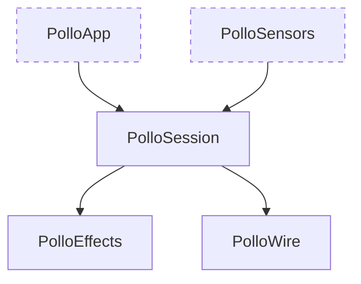
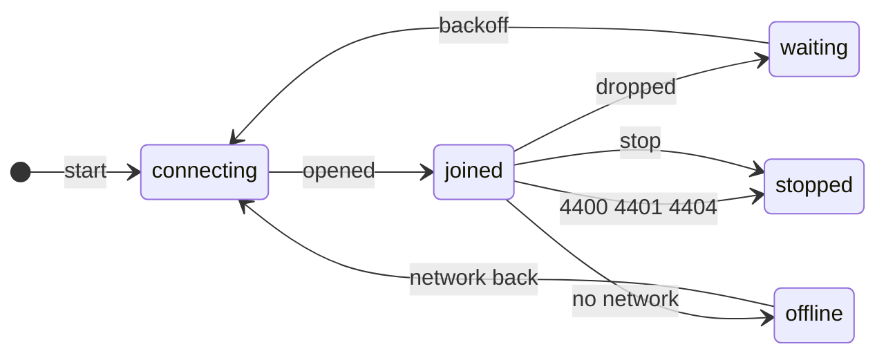
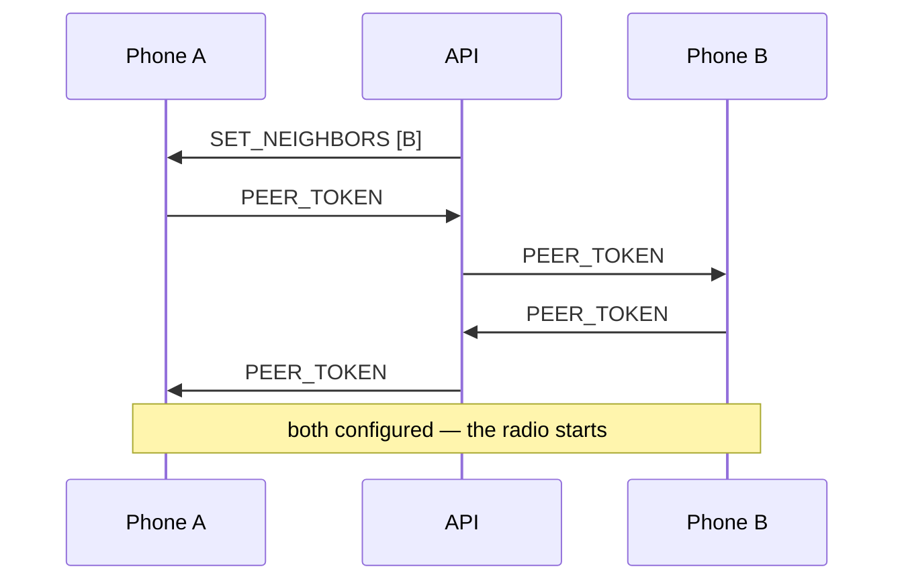

# Mobile

The sensor of the system. A phone reports its GPS reading and the ultra-wideband
distance to the peers the server names, and gets back its own position and the
cues it renders itself.

```bash
just mobile-build      # no Apple framework needed
just mobile-test       # 35 tests, no Xcode needed
just mobile-fixtures   # rewrite the Swift test fixtures from the contract
```

## There is no app yet

What exists is `PolloKit`: three targets that import nothing from Apple, so all
of it builds and is tested on any machine. The adapters and the screen sit above
it and need the iOS SDK.



The line is where it is on purpose: everything that *decides* something is below
it, and what is above only moves bytes between a radio and a struct. The client
this replaces had no such line, which is why none of it could be tested.

## The shape of it

`PolloSession` has no I/O, no clock and no randomness. It takes what happened
and returns what to do about it — `handle(input, at: now) -> [Command]` — with
`now` handed in and the jitter injected. The tests move time by hand.

| in | out |
|---|---|
| `opened` `closed` `network` | `connect` `disconnect` |
| `located(fix)` `measured(d, peer)` | `send(frame)` |
| `received(frame)` `minted` `lostPeer` | `beginRanging` `configureRanging` `endRanging` |
| `tick` | |

One ticker drives both the sweep and the reconnect. A client that wakes a
crowd's worth of timers to do nothing is the problem this app exists to avoid.

## The connection



Three ways to lose a socket, and they are not the same:

| | |
|---|---|
| **Dropped** | Retry, after a delay drawn from under a ceiling that doubles. Full jitter, because whatever disconnects one client disconnects the crowd. |
| **Rejected** | The server saying the socket was *wrong*. Retrying is how a client turns a rejection into a denial of service. |
| **No network** | Nothing to back off from. Waits, then comes straight back. |

`stop` invalidates every radio session and disconnects, and no tick brings it
back. The old client called `reconnect()` from inside `close()`.

## Ranging takes two

Each `NISession` holds one peer and its own token, so eight peers means eight
sessions and sixteen tokens. Neither phone can start without the other's.



The server relays the blob without reading it. B was never told to measure A and
opens a session anyway: the server's lists are not symmetric, so refusing would
leave the edge it asked for measured by nobody. `RangingPlan` keeps the two
reasons apart — **assigned** and **courting** — and diffs each new list rather
than rebuilding it, since rebuilding restarts the radio for everybody every time
anyone moves.

The cap on concurrent sessions is the largest energy dial here, and is currently
the server's `DEFAULT_DEGREE` of 16 — a number chosen against a simulator where
a measurement is free. It wants Instruments, not an argument.

## What a sweep says

Readings arrive at tens of hertz and go out as one frame every two seconds
(`docs/scaling-io.md` §7). Three statements, and the wire distinguishes all
three:

| | |
|---|---|
| `distance: 3.2` | Measured, and far enough from what the server holds to be worth sending. |
| `distance: null` | Retracts the edge. The only thing that ever removes one. |
| *absent* | Not measured. Says nothing. |

A radio that stops hearing somebody reports no failure, so two silent sweeps
retract the edge. `Measurement` carries a hand-written encoder because a
synthesised one drops a `nil` key — turning every retraction into silence.

`LocationGate` is the same idea for GPS: a fix inside the uncertainty the server
already holds carries no information. A much sharper one does, standing still or
not, because the worker weights each anchor by one over the variance it claimed.

## Nothing drifts, because a test says so

The Swift types are hand-written; codegen costs more than it saves at this size.
`tools/emit-fixtures.ts` walks the Zod schemas and writes a sample of every
frame plus 96 brightness cases. The Swift decodes each one, re-encodes it and
compares — decoding alone would miss a field read under the wrong name. Adding a
message without a sample is a type error, and `just mobile-fixtures` is
deterministic, so CI fails on a dirty tree.

## Next

`PolloSensors` and `PolloApp`, then the energy measurement that settles the
ranging cap — the only number in here that is still a guess.
