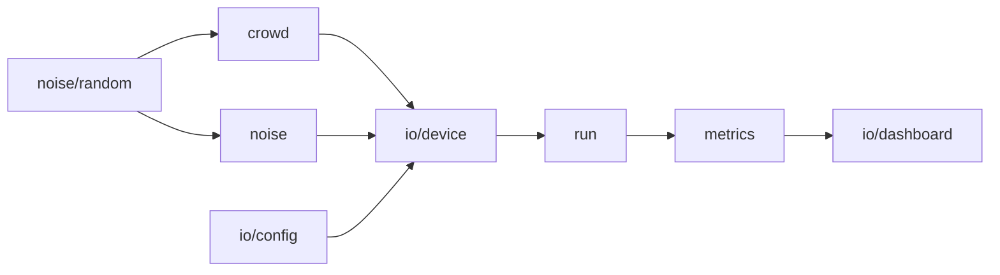

# Simulator

A crowd of phones is not a thing anyone has lying around. This workspace
emulates one: it seats an audience, gives everybody a receiver that lies about
where it is, and reports the results over the same sockets a real device would
use.

```bash
just simulate --event <uuid> --venue theater --clients 500   # --help lists every knob
```

The event has to be open — create one in the panel and pass its id. Nothing else
is needed: `GET /events/:eventId` is public, so the origin comes back without a
token.

## Why it exists

`apps/backend` speaks the whole protocol but has never seen more than a handful
of devices, and the worker that turns readings into positions is written by hand
against this bench. Before that worker exists there has to be something that
produces its input, and measures its output against a truth only the simulator
knows.

## The three venues

Pollo is not a stadium app. It runs wherever a crowd has phones, and the shape
of the crowd is the input to everything downstream — so `--venue` picks one:

| | |
|---|---|
| `square` | A flat square of standing people: a club, a hall, an open field. Flat, unstructured, and therefore the control. |
| `stands` | A raked block of rows around a pitch. Neighbours are close along a row and a step apart across one. |
| `theater` | Curved rows facing a stage, a gangway down the middle, and two balconies overhanging the back of the floor. |

Every venue sizes itself to `--clients` and carries a few spare seats, because
people move. What they look like, and what each one is for, is in
[`src/crowd/`](src/crowd).

## The noise

Anything can add a random number to a coordinate. A worker tuned against that
has been tuned for a world nobody lives in, so three things are modelled rather
than sampled:

**The error drifts.** A fix is not redrawn every second — it wanders and comes
back, on two time scales at once: it jitters over seconds and also slides across
the afternoon. Ornstein–Uhlenbeck, exact discrete form, so the same process
holds its σ whatever step size a thread hands it.

**The crowd is wrong together.** Phones standing five metres apart listen to the
same satellites through the same sky, so most of what they get wrong, they get
wrong *together* — `--common-mode` is that share, 0.8 by default. It matters
because a common offset slides the whole cloud without deforming it, which is
precisely the error a reconstruction from distances cannot see and raw GPS
suffers in full.

**The room decides the budget.** Each venue declares how wrong a fix is in that
kind of place — 4 m in the open, 15 m indoors — and every handset draws its own
quality around it. Not derived from geometry: what a phone can see of the sky
depends on the roof, the balcony, the body in front of it and the building next
door, none of which a simulator honestly knows.

On top of all that, people are never quite still, phones lose signal for a few
seconds, and people leave and come back. `--churn`, `--blackout` and
`--move-prob` are the rates, per minute.

## Who a phone is allowed to measure

A device may only range against peers **the API has told it about**. On joining
it reads `GET /events/:id/participants` for the crowd already present, and
`USER_JOINED` and `USER_LEFT` on its socket are the continuation of that snapshot
— which is read *after* the socket is up, or an arrival in between belongs to
neither and would never be mentioned again.

This is not bookkeeping. Two phones cannot range each other over UWB until each
holds the other's discovery token, and that token only ever arrives out of band:
the message is the credential, and without it there is nothing to attempt. A
simulator that picks neighbours out of its own ground truth is measuring a world
where discovery is free, and the worker gets tuned against a graph no crowd can
produce.

The spatial grid stays, with a narrower job: it is the **radio**, not the roster.
It answers who is close enough to be heard, which is physics, and the candidates
for a sweep are that answer intersected with what the phone knows. Knowledge
survives a blackout — a phone has not forgotten the room it is standing in — so
what a device loses while offline is only whoever arrived meanwhile, and the
roster it reads on the way back repairs that.

## Reading a run

Two screens, and `V` swaps them.

### The chart

The chart carries **two lines**, and that is the whole point of it. On its own
the worker's error means nothing — there is no scale on which "4.2 m" is good or
bad. Raw GPS, given exactly the same treatment, is the control, and the gap
between the two lines is what the worker is worth. Before a worker exists, only
the control is drawn, and that is still the answer to a real question.

Both are RMSE after a Procrustes alignment. A reconstruction built from
distances has no idea which way north is, so scoring it against the truth
directly measures an ambiguity rather than a geometry — see
[`src/metrics/align.ts`](src/metrics/align.ts).

### The field

An RMSE is one number over the whole crowd, and the same number covers error
spread thinly across everybody and error piled onto one corner. Those are not the
same show. The field view puts the difference back on screen:

**Where a dot sits is the truth. How bright it is comes from the estimate.**

Every phone is projected onto one horizontal plane — `z` is dropped, so in the
`theater` the balcony lands on top of the stalls — and drawn at the seat the
simulator gave it. Its brightness is `effectBrightness` over the position the
*worker* published back, about the centroid of the placed estimates, which is
exactly what the admin panel computes. Fire a cue from the panel and watch both:
the panel draws the estimate, so its ring is always clean over a crowd of
whatever shape the worker imagined. Here the crowd is where it really is, and a
worker that has people in the wrong place lights the wrong people. The ring
arrives as confetti.

Devices the worker has not placed stay dark. Its coverage reads as holes in the
crowd, which is the honest thing for a screen that measures the worker — with no
worker running, nothing lights at all, and that is the baseline rather than a
bug.

Every run prints its seed and replays exactly from it. `--json` swaps the
dashboard for NDJSON; without colour (piped, or `NO_COLOR`) the field falls back
to one glyph per cell on a brightness ramp. `--view field` opens on it, which is
the only way to reach it when nothing owns a terminal to press `V` on.

## Layout

```
src/
  crowd/    build an audience — the three venues, who sits where, who is close enough to hear whom
  noise/    the drift the crowd shares, the sway of standing still, what a radio measures
  io/       argv, the API, the socket each device holds, the two terminal screens
  metrics/  Procrustes alignment, and the summaries the chart draws
  run/      threads, and the memory they share
```

They compose in one direction:



A device owns no timer: a shard ticks every one of its phones on a single clock,
because twenty thousand intervals is a scheduler benchmark rather than a crowd.
It does not own its socket either — `io/transport.ts` is a seam, so what a
device does when it joins, drifts, drops and comes back can be tested without
standing up a server. That is [`src/io/device.test.ts`](src/io/device.test.ts).
