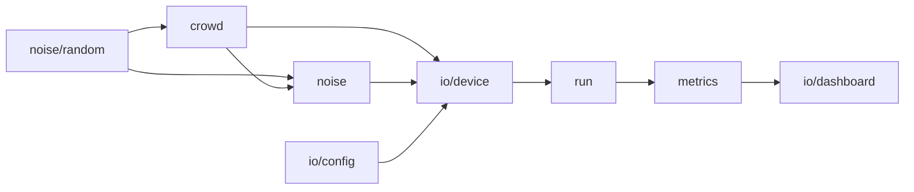

# Simulator

Twenty thousand phones is not a thing anyone has lying around. This workspace
emulates them: it seats a crowd in a stadium, gives each seat a receiver that
lies about where it is, and reports the results over the same sockets a real
device would use.

```bash
just simulate --event <uuid> --clients 20000     # --help lists every knob
```

The event has to be open — create one in the panel and pass its id. Nothing else
is needed: `GET /events/:eventId` is public, so the origin comes back without a
token.

## Why it exists

`apps/backend` speaks the whole protocol but had never seen more than a handful
of devices, and the worker that turns readings into positions is written by hand
against this bench. Before that worker exists there has to be something that
produces its input with enough fidelity to be worth solving, and measures its
output against a truth only the simulator knows.

Three questions, and none of them can be answered with a crowd of five: whether
the backend survives the load, whether the geometry can be reconstructed at all,
and how much the reconstruction improves on raw GPS.

**The noise is the product.** Anything can add a random number to a coordinate;
a worker tuned against that has been tuned for a world nobody lives in. What
each module models, and why that model rather than the cheap one, is written
down next to the code.

## The five modules

| module | what it owns |
|---|---|
| [`crowd/`](src/crowd) | **Build an audience.** Seats in the bowl, what each patch of it can see of the sky, and who is close enough to hear whom. |
| [`noise/`](src/noise) | **Add noise.** Drift, what the crowd gets wrong together, reflections off the concrete, and what a radio actually measures. |
| [`metrics/`](src/metrics) | **Measure the error.** Procrustes alignment, and the summaries the chart draws. |
| [`io/`](src/io) | **Talk to the world.** Argv, the API, the socket each device holds, the terminal. |
| [`run/`](src/run) | **Orchestrate.** Threads, and the memory they share. |

They compose in one direction. `crowd` knows nothing but how to draw a random
number; `noise` reads the crowd's geometry to decide how badly a seat is served;
`io` puts a device on a socket with both; `run` spreads devices across threads
and hands `metrics` the result.



## Reading a run

The chart carries **two lines**, and that is the whole point of it. On its own
the worker's error means nothing — there is no scale on which "4.2 m" is good or
bad. Raw GPS, given exactly the same treatment, is the control, and the gap
between the two lines is what the worker is worth.

Both are RMSE after a Procrustes alignment. A reconstruction built from
distances has no idea which way north is, so scoring it against the truth
directly measures an ambiguity rather than a geometry — see
[`metrics/`](src/metrics).

Every run prints its seed and replays exactly from it. `--json` swaps the
dashboard for NDJSON.

## Two limits that are not the same limit

`--range` is how far the radio can hear, which bounds the **true** distance.
`--max-edge` is the longest distance a device will put on the wire, and defaults
to `--range`. They differ because the ranging error is multiplicative and biased
long: an uncapped six-metre radio emits edges of sixty. The surviving
measurements are censored rather than clamped — dropped, not squashed against
the limit — and the worker meets the same censored distribution in the field.
See [`noise/`](src/noise).
