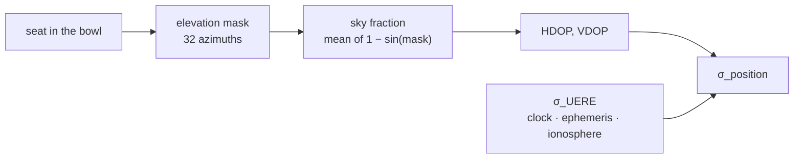

# crowd — building an audience

Where twenty thousand people are, and what the building does to each of them.

Nothing here is random in the interesting sense: the bowl is a pure function of
the seed, so every thread derives the same stadium independently and no seat is
ever sent across a thread boundary. What varies is who sits where.

## Contents

- [The bowl](#the-bowl) — the plan, the rake, and where the seats are
- [Filling it](#filling-it) — which seats are taken
- [What a seat can see of the sky](#what-a-seat-can-see-of-the-sky) — masks, DOP
- [Who can hear whom](#who-can-hear-whom) — the neighbour index

## The bowl

### The plan is a superellipse, not an ellipse

Rows follow `|x/a|ⁿ + |y/b|ⁿ = 1` with **n = 4**.

An ellipse (n = 2) is the parametrisation that falls out of a first attempt and
it produces a shape no venue has: the corners collapse onto the diagonal and the
straight runs along the touchlines disappear. Real bowls are rounded rectangles.
At n = 4 the straights survive, which matters because the straights are where
the crowd is densest and where the geometry a reconstruction has to recover is
least ambiguous.

`superellipsePoint` uses the signed-power form. A naive `x^(2/n)` root loses the
sign and the curve breaks where it crosses an axis.

### Seats are placed by arc length, not by angle

The superellipse is not parametrised by arc length. Stepping `t` evenly bunches
seats into the corners — visibly, and by a factor that grows with `n`. So each
row is polygonised once into 4,000 segments, the cumulative length is
accumulated, and seats are placed by walking that table at a constant
`seatPitch`.

### Stairways are cut out

A seamless carpet of seats would flatter a reconstruction: the gaps are part of
what makes the problem real. Aisles are cut every `aisleEvery` seats, and the
cut is **offset by row** so the gangways read as radial lanes rather than a
spiral.

Seat positions carry a ±5 cm jitter. Real people are not on a lattice, and a
perfect lattice gives an estimator a regularity to exploit that it will not find
in a stadium.

## Filling it

A crowd does not distribute itself evenly. The lower ring fills first, some
sectors stay half empty, and the upper ring holds more seats than the lower one
while being the last to fill — so its weight has to undo that head start before
the weighting means anything.

Seats are drawn with **Efraimidis–Spirakis (A-Res)**: key each seat by `u^(1/w)`
and take the largest keys. That is a weighted sample without replacement in one
pass, with no rejection loop to stall on a nearly-full stadium. Rejection
sampling would degrade exactly where the load test is most interesting.

> A numerically more stable variant keys by `−ln(u)/w` and takes the smallest.
> At these weights (0.14 to 1) and this population it makes no difference, but
> it is the form to reach for if weights ever span orders of magnitude.

## What a seat can see of the sky

This is the bridge between the building and the error budget: where you sit
decides how much sky you have, how much sky you have decides your geometry, and
your geometry multiplies every range error your receiver makes.



Computed **once per zone**, not per device. The sky a seat can see is a property
of where in the bowl it sits, and 48 zones answer that as well as twenty
thousand ray casts would, for four orders of magnitude less work.

### The mask: where concrete replaces sky

For each of 32 azimuths around a zone's centroid, `elevationMask` finds the
elevation below which the view is building rather than sky. Two things block it:

- **The rim.** The outermost row of the outer tier cuts off low satellites in
  every direction. `firstCrossing` marches out to the superellipse and bisects —
  a closed form exists only for a few exponents, and this runs a few thousand
  times at startup and never again.
- **The canopy.** For seats it reaches over, everything outward is roof all the
  way past the rim; only the ray back over the pitch escapes, and it escapes
  past the roof's inner edge.

### From mask to sky fraction

Solid angle on a hemisphere goes as `cos(e) de`. Integrating from the mask to
the zenith gives `1 − sin(mask)` for a single azimuth, so averaging that across
azimuths is the visible fraction of the whole sky. One number per zone, in
[0, 1].

### From sky fraction to DOP

Position error is **geometry multiplied by range error**:

```
σ_position = DOP × σ_UERE
```

σ_UERE is what the receiver gets wrong about a single satellite's range — clock,
ephemeris and ionosphere together, before geometry touches it. DOP is what the
satellite arrangement does to it.

**The vertical is always the worse of the two, and it degrades faster.** The
reason is geometric and one-sided: no satellite is ever below the horizon. There
is nothing underneath a receiver to balance what is above it, so the geometry
fixing height is weak before anything blocks it — and the low satellites a mask
removes are precisely the ones that were holding it together. Published figures
put VDOP at roughly 1.5–3× HDOP under normal conditions.

The model:

```
HDOP = min(4,  0.8 / sky^1.10)
VDOP = min(9,  1.4 / sky^1.45)
```

The exponents are **fitted to that spread, not derived** — there is no closed
form from sky fraction to DOP, because DOP depends on where the satellites
actually are and not merely on how much sky is open. What the built model
produces across the bowl is σ_h of 7–16 m and σ_v of 16–36 m, a ratio of
2.3–2.9, which lands inside the published band.

The ceilings are load-bearing. The deepest seats under the canopy see so little
sky that an unbounded fit runs away, while a real receiver either holds around
fifteen metres or stops reporting a fix at all.

### Where a reflected fix goes

A stand rises behind the crowd, so the satellites whose direct path it blocks
are the **outward** ones. Their signals arrive only after a bounce — a longer
path, a pseudorange read as too long — and a solution pushed away from those
satellites moves **inward, over the pitch**. A reflection off a surface overhead
drags it down as well, hence the `z: −0.5` component.

Each zone therefore carries a bias direction, and `noise/multipath.ts` supplies
the dwell times and magnitude that ride on it.

Susceptibility is `1 − skyFraction`, raised 40% for roofed tiers: a canopy is
both a blocker and a reflector, and the seats under it get more of each.

## Who can hear whom

A device ranges its neighbours several times a minute. Comparing each one to
twenty thousand others is four hundred million distance checks a sweep, so
`grid.ts` is a uniform grid over the crowd's true positions and a query touches
nine cells.

**It is built over the whole crowd, not one thread's slice.** A device at the
edge of a shard's range has real neighbours owned by another thread, and an
index that stopped at the boundary would quietly thin the distance graph exactly
where the crowd is continuous.

**Cells are laid out by counting sort** into two flat arrays — a start table and
an entry list. Twenty thousand small arrays rebuilt every few seconds would keep
the garbage collector busy for nothing.

**Height is deliberately not indexed.** A bowl is wide and shallow compared to a
six-metre radio range, so a third dimension would mostly add empty cells. The
candidates a 2D query returns are filtered by true 3D distance anyway, so the
answer is identical and the index is smaller.

The grid takes its "is this device present" bit mask as a constructor argument
rather than importing it. That is what keeps `crowd/` from reaching into
[`run/`](../run) for a storage detail it does not otherwise care about — the
module depends on nothing but [`noise/random`](../noise).

## Parameters

| symbol | value | provenance |
|---|---|---|
| `planExponent` | 4 | calibrated — the lowest exponent that keeps the touchline straights; n=2 collapses them |
| `pitchLength` × `pitchWidth` | 105 × 68 m | literature — the dimensions the Laws of the Game recommend for a competitive pitch |
| `seatPitch` | 0.5 m | calibrated — a seat width; sets the perimeter density |
| `aisleEvery` / `aisleWidth` | 40 / 3 seats | calibrated — produces gangways at a plausible spacing |
| `phoneHeight` | 1.4 m | calibrated — chest height on a standing crowd |
| `seatJitter` | ±0.05 m | calibrated — enough to defeat lattice regularity, small against every error modelled |
| tier rake (`rise`/`rowDepth`) | 0.45/0.8 lower, 0.52/0.8 upper | calibrated — a steeper upper ring, as built |
| `roofHeight` / `roofDepth` | 44 m / 26 m | calibrated — sets which seats lose sky to the canopy |
| `ANGULAR_SECTORS` × `ROW_BANDS` | 8 × 3 per tier (48 zones) | calibrated — fine enough that neighbouring seats share a sky, coarse enough to cost nothing |
| `SIGMA_UERE` | 4 m | calibrated, between two published anchors — the standard budget totals ±6.7 m at 3σ (≈2.2 m at 1σ) for older single-constellation figures, while a worked example in the Penn State course uses 6 m. Four is the modern multi-constellation case, and no source states it. |
| `AZIMUTH_SAMPLES` | 32 | calibrated — the mask varies slowly with azimuth; 32 is past the point where more changes the integral |
| DOP coefficients `0.8` (H), `1.4` (V) | open-sky DOP | calibrated — the open-sky end of the published "ideal / excellent" DOP band, with V above H |
| DOP exponents `1.10` (H), `1.45` (V) | — | calibrated — fitted so the modelled V/H ratio lands at 2.3–2.9, inside the published 1.5–3× |
| DOP ceilings `4` (H), `9` (V) | — | calibrated — an unbounded fit runs away under the canopy; a real receiver holds or drops the fix |
| multipath susceptibility roof factor | 1.4 | calibrated — a canopy both blocks and reflects |
| bias `z` component | −0.5 | calibrated — a reflection off a surface overhead drags the fix down as well as inward |

## Sources

- [Superellipse](https://en.wikipedia.org/wiki/Superellipse) — the Lamé curve,
  its exponent, and the signed-power parametrisation
- [Reservoir sampling § Algorithm A-Res](https://en.wikipedia.org/wiki/Reservoir_sampling)
  — Efraimidis–Spirakis weighted sampling without replacement, the `u^(1/w)`
  key, and the more stable `−ln(u)/w` variant
- [Penn State GEOG 862 — Dilution of Precision](https://courses.ems.psu.edu/geog862/node/1771)
  — the σ_position = DOP × σ_UERE relation, stated as "the standard deviation of
  the GPS position is the dilution of precision factor multiplied by the square
  root of the sum of the squares of the individual biases (UERE)", with a worked
  example at PDOP 1.5 and UERE 6 m
- [Error analysis for the Global Positioning System](https://en.wikipedia.org/wiki/Error_analysis_for_the_Global_Positioning_System)
  — the per-source UERE budget (ionosphere ±5 m, ephemeris ±2.5 m, satellite
  clock ±2 m, troposphere ±0.5 m, multipath ±1 m), totalling ±6.7 m at 3σ for
  C/A. Note the ±1 m multipath entry is the *nominal* case; the article adds
  that multipath is "more severe in urban canyons", which is why a stadium bowl
  gets a separate model in [`noise/`](../noise) rather than a bigger σ.
- [Dilution of precision (navigation)](https://en.wikipedia.org/wiki/Dilution_of_precision_(navigation))
  — the DOP rating bands (< 1 ideal, 1–2 excellent, 2–5 good) the open-sky
  coefficients sit against
