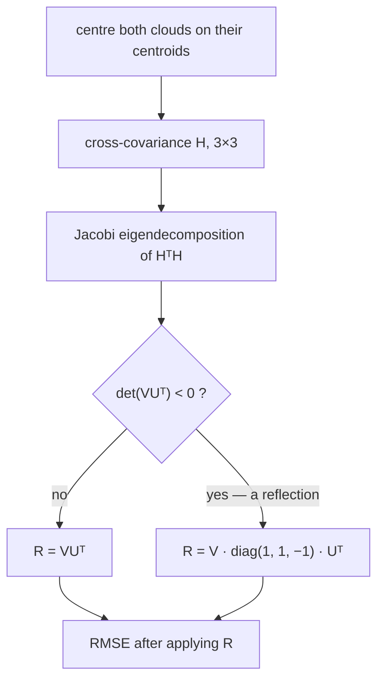

# metrics — measuring the error

Two clouds of points and the question "how far apart are they". It is less
obvious than it sounds, and getting it wrong produces a number that looks like
accuracy and is not.

## Why alignment is needed at all

**A reconstruction built from distances alone is invariant to rotation,
translation and reflection.**

If all you know is that A is 4 m from B and B is 6 m from C, you know the shape
of the crowd. You do not know which way it faces, where it sits, or whether you
are looking at it from the front or through the back of the paper. Every rotated
copy of the right answer fits the distance data exactly as well.

So a worker can recover the geometry **perfectly** and still show a sixty-metre
point-to-point error, purely because its cloud came out turned. Comparing the
clouds without aligning them first measures the arbitrary part of the answer and
reports it as accuracy.

The fix is the **orthogonal Procrustes problem**: find the rigid motion that
best carries one cloud onto the other, apply it, and *then* measure.

## Both numbers are kept, and they say different things

| | what it measures |
|---|---|
| `raw` | what a phone would experience if it rendered the estimate directly |
| `aligned` | how well the geometry was actually recovered |

The **gap between them is the rigid misalignment**. A large gap is a missing
anchor, not a bad solver — it says the shape is right and nothing has told the
system which way north is. Reporting only the aligned number would hide a real
deployment problem; reporting only the raw one would blame the solver for it.

## What is deliberately not fitted

**Scale.** Umeyama's extension of Kabsch also estimates a scale factor, and it
is tempting because it always lowers the error. It is wrong here: the distances
are metric. A reconstruction that comes out 15% too large is *wrong by 15%*, and
absorbing that into the fit would hide the single most diagnostic failure the
bench can detect.

**Reflection.** A mirrored cloud is not a valid answer — no rigid body is its
own mirror image, and a crowd reconstructed inside-out has failed even though
every pairwise distance checks out. The determinant guard below refuses it
rather than accepting a flattering score.

## How it is computed

Kabsch, by way of the eigendecomposition of `HᵀH` rather than a general SVD
routine.

1. Centre both clouds on their centroids (this is the translation).
2. Build the 3×3 cross-covariance `H`.
3. Decompose, and form the rotation.
4. **Guard the determinant.** `d = det(VUᵀ)`; if it is negative the candidate is
   a reflection, and the smallest singular direction is flipped:
   `R = V · diag(1, 1, d) · Uᵀ`. This is the standard correction, and it is what
   makes the result a proper rotation rather than merely an orthogonal matrix.

### Why a Jacobi eigensolver

`symmetricEigen` runs cyclic Jacobi rotations on the symmetric 3×3 `HᵀH`. Ten
sweeps is far past convergence at this size.

The obvious alternative — solving the characteristic polynomial in closed form —
loses precision exactly where the matrix is nearly degenerate. For this data
that is not a corner case: a crowd in a stadium bowl is close to planar, so the
smallest eigenvalue is genuinely small and a closed form would be least accurate
precisely in the normal operating condition.

The covariance sums are accumulated in locals rather than into an array. It is
nine running sums over twenty thousand points, and a bounds check per term is
the one place in this module where that would be measurable.

## The two populations are compared separately

`pool.ts` gathers the worker's cloud and the raw-GPS cloud independently,
because their populations differ: every device that has reported has a GPS
position, but only the ones the worker has placed have an estimate. Each is
aligned against the truth **of its own population**.

That is the point rather than a caveat — coverage is part of the answer. A
worker that places 20% of the crowd very accurately has not beaten raw GPS.

## Sources

- [Kabsch algorithm](https://en.wikipedia.org/wiki/Kabsch_algorithm) — the
  algorithm, its RMSD-minimising property, and the determinant correction quoted
  above: "record if the orthogonal matrices contain a reflection, d = det(UVᵀ)…
  calculate our optimal rotation matrix R as R = U[(1,0,0),(0,1,0),(0,0,d)]Vᵀ"
- [Orthogonal Procrustes problem](https://en.wikipedia.org/wiki/Orthogonal_Procrustes_problem)
  — the problem this is an instance of
- S. Umeyama, "Least-squares estimation of transformation parameters between two
  point patterns", *IEEE PAMI* **13**(4), 1991 — the extension that also fits
  scale, which is the part deliberately not used here
- [Jacobi eigenvalue algorithm](https://en.wikipedia.org/wiki/Jacobi_eigenvalue_algorithm)
  — the symmetric eigensolver used instead of a closed form
