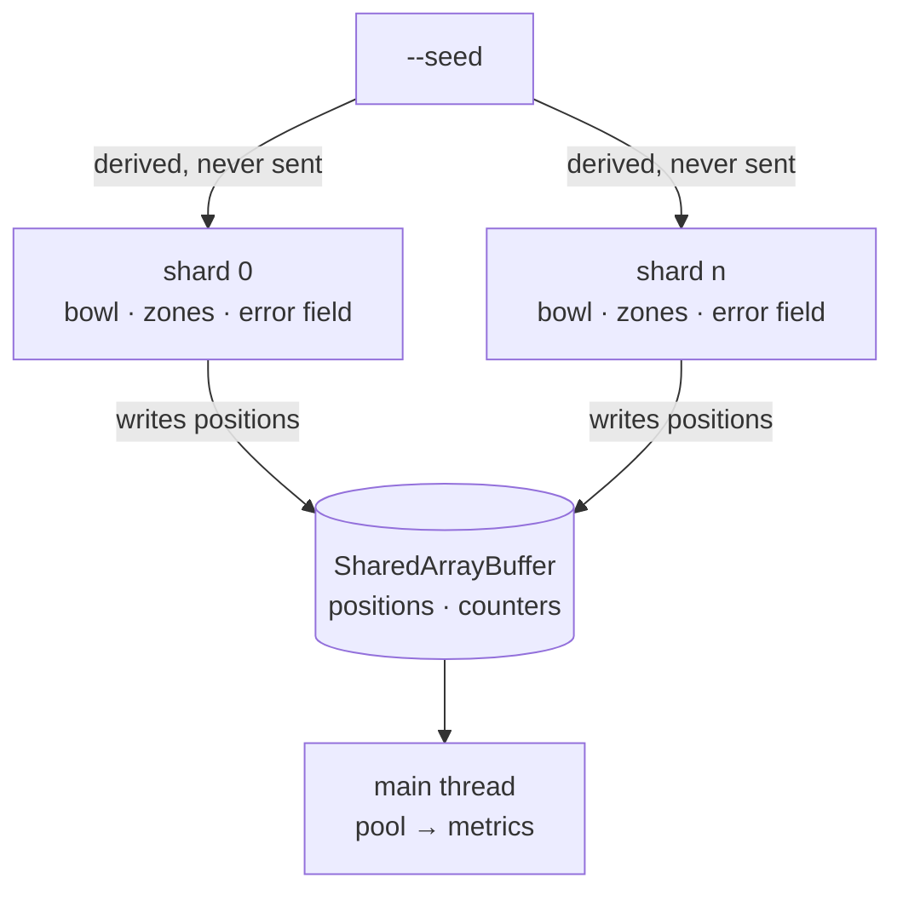

# run — threads, and the memory they share

Twenty thousand WebSockets do not fit on one event loop. This module spreads
them across `worker_threads` and reassembles what they produce.

## Contents

- [Why shared memory](#why-shared-memory) — rather than `postMessage`
- [What is *not* shared](#what-is-not-shared) — the more interesting half
- [The clock](#the-clock) — how shards agree without talking
- [Starting a thread on TypeScript](#starting-a-thread-on-typescript)

## Why shared memory

Positions live in `SharedArrayBuffer`, not in messages. Two things force it:

- **Neighbours cross shard boundaries.** A device at the edge of one thread's
  slice ranges against devices owned by another. The spatial index has to see
  the whole crowd or the distance graph thins exactly where the crowd does not.
- **The alignment is over the whole crowd at once.** Procrustes is not
  decomposable per shard.

Passing either through `postMessage` would mean copying six hundred kilobytes
twice a second and pausing every shard to do it.

**The shards never compute metrics.** They write positions; the pool reads them.
Twenty thousand positions scanned twice a second is something the main thread
can afford, and it keeps the threads doing the one thing they exist for.

Counters are `Atomics.add`, and the rate counters are read with
`Atomics.exchange` — read and reset in one operation, so a rate can be taken
over "since the last read" without any shard needing to know when that was.

## What is *not* shared

More interesting than what is.

The bowl, the zones and the shared error field are **pure functions of the
seed**. Every shard derives all three independently rather than receiving them.
Fifty thousand seats are never serialised across a thread boundary, and — the
part that matters — twenty thousand devices across eight threads agree on their
common-mode GNSS error **without exchanging a single message about it**.



Spare seats are divided the same way: each shard takes a disjoint slice of
what is empty, so two threads can never walk a device into the same seat and no
lock is needed to prevent it.

## The clock

Every shard gets the same `epoch` and advances the error field by **absolute
tick index**, not by elapsed time:

```
field.advanceTo(floor((now − epoch) / FIELD_TICK_SECONDS))
```

A thread that stalls replays the ticks it missed instead of taking one large
step. That is not an optimisation — a large step is not the same random path, so
without it a scheduling hiccup on one thread would silently desynchronise that
shard's crowd from everyone else's.

The connection ramp is spread by **global** device index rather than by position
within the shard. Otherwise every thread opens its first socket at the same
instant and the ramp only staggers the tail.

## Starting a thread on TypeScript

`shard-entry.mjs` exists because `Worker`'s `execArgv` **silently drops
`--import`**. A thread started directly on `shard.ts` fails with "Unknown file
extension" even though the main process runs TypeScript fine.

The entry point registers the `tsx` loader from inside the thread and then
imports the real one, which is what makes the shard see the same module graph
the main thread does. It stays plain JavaScript by necessity: it is what runs
before there is anything to compile TypeScript with.

## Shutdown

`stop()` listens with `on` rather than `once`. A shard's `ready` message can
still be in flight when the stop is issued, and consuming that as the answer
would leave the acknowledgement it was actually waiting for with no listener at
all — the run would then hang until the timeout on every shard.

A shard that does not answer within two seconds is terminated anyway. The run is
over; waiting on a wedged thread helps nobody.
